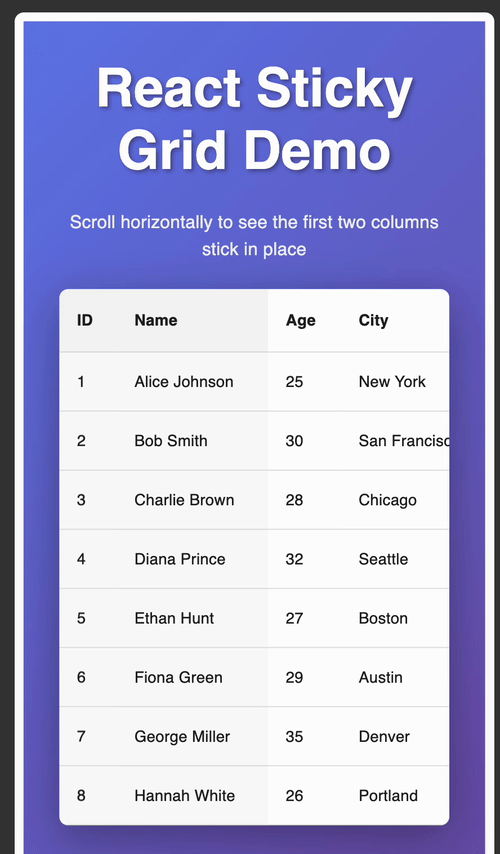

# React Sticky Grid

A reusable React grid/table component with sticky columns, built using TanStack Table and Material UI.



## Features

- 🔒 **Sticky columns** - Keep left-most columns fixed while scrolling horizontally
- 📌 **Sticky headers** - Table headers remain visible when scrolling vertically
- 🎨 **Customizable styling** - Control cell appearance via props
- 🚀 **TanStack Table powered** - Works with sorting, filtering, and pagination
- 💅 **Material-UI components** - Beautiful, accessible table elements
- 📦 **TypeScript support** - Fully typed for better developer experience

## Installation

```bash
npm install react-sticky-grid
```

## Usage

```tsx
import { StickyGrid } from "react-sticky-grid";
import { ColumnDef } from "@tanstack/react-table";

type Person = {
  id: number;
  name: string;
  age: number;
  city: string;
};

const data: Person[] = [
  { id: 1, name: "Alice", age: 25, city: "New York" },
  { id: 2, name: "Bob", age: 30, city: "San Francisco" },
];

const columns: ColumnDef<Person>[] = [
  { accessorKey: "id", header: "ID" },
  { accessorKey: "name", header: "Name" },
  { accessorKey: "age", header: "Age" },
  { accessorKey: "city", header: "City" },
];

function App() {
  return (
    <StickyGrid 
      data={data} 
      columns={columns} 
      stickyColumns={2} 
    />
  );
}
```

## Props

### `StickyGrid<T>`

| Prop | Type | Default | Description |
|------|------|---------|-------------|
| `data` | `T[]` | required | Array of data objects to display |
| `columns` | `ColumnDef<T>[]` | required | TanStack Table column definitions |
| `stickyColumns` | `number` | `1` | Number of left-most columns to keep sticky |
| `cellProps` | `TableCellProps` | `{ sx: { whiteSpace: "nowrap" } }` | Custom props applied to all table cells |

## Customization

### Cell Styling

Control text wrapping and other cell styles:

```tsx
<StickyGrid 
  data={data} 
  columns={columns}
  cellProps={{
    sx: {
      whiteSpace: "nowrap",  // Prevent text wrapping (default)
      padding: 2,
      fontSize: 14,
    }
  }}
/>
```

### Allow Text Wrapping

```tsx
<StickyGrid 
  data={data} 
  columns={columns}
  cellProps={{ sx: { whiteSpace: "normal" } }}
/>
```

## Development

```bash
# Install dependencies
npm install

# Start development server with demo
npm run start

# Build library
npm run build

# Run tests
npm run test
```

The dev server runs on `http://localhost:3000` and displays a demo of the sticky grid component.

## Release

Use the release script to bump version, tag, and push:

```bash
# Patch release (0.1.0 -> 0.1.1)
./scripts/release.sh patch

# Minor release (0.1.0 -> 0.2.0)
./scripts/release.sh minor

# Major release (0.1.0 -> 1.0.0)
./scripts/release.sh major
```

The script will:
- Validate no uncommitted changes exist
- Bump the version in `package.json`
- Build the library
- Commit and tag the release
- Push to remote repository

After running the script, publish to npm with `npm publish`.

## Tech Stack

- React 18
- TypeScript
- TanStack Table v8
- Material-UI v5
- Vite

## License

MIT
